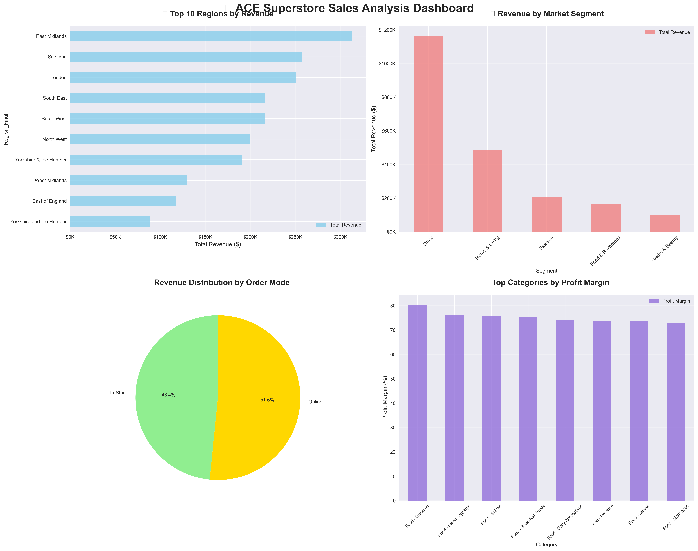
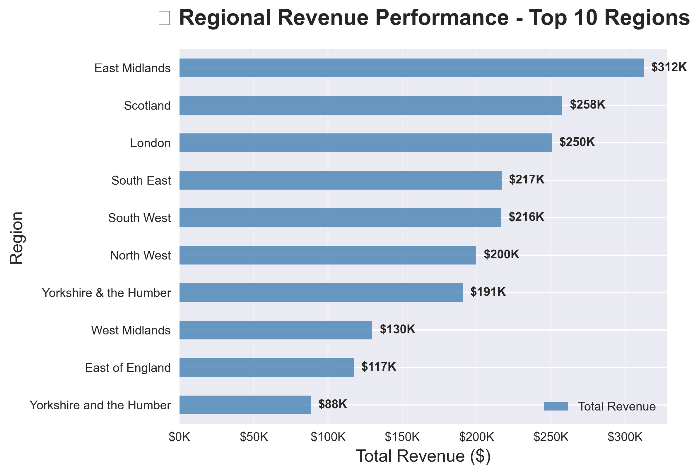
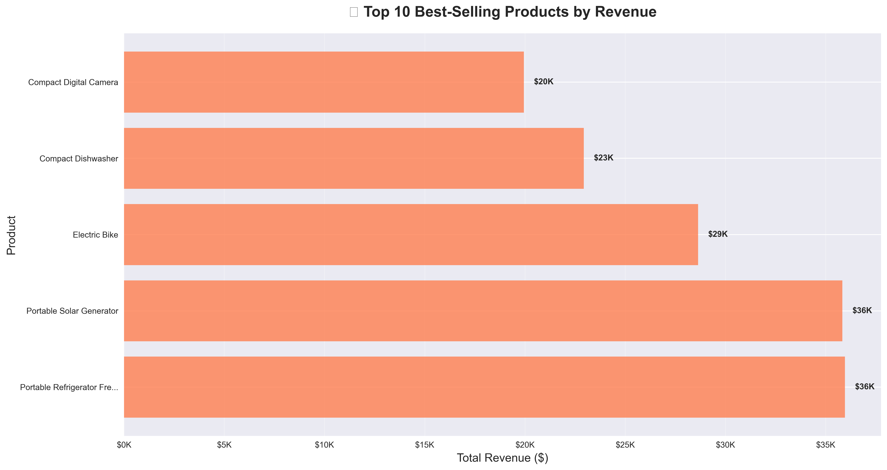
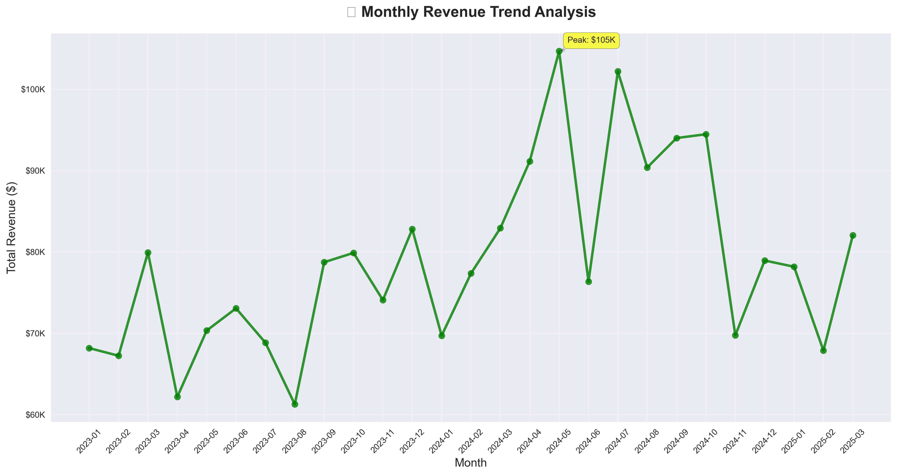
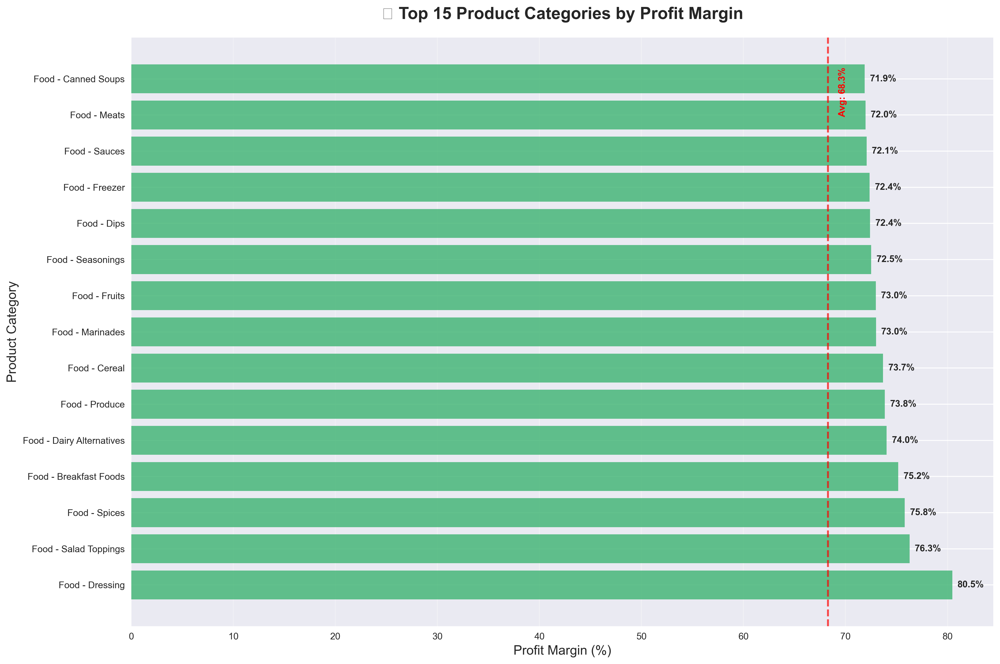
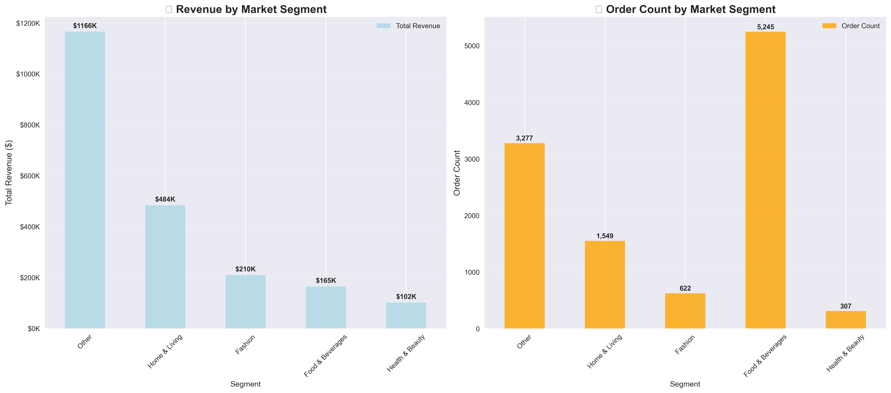

# 📊 ACE SUPERSTORE BUSINESS INTELLIGENCE REPORT
**Executive Summary & Strategic Recommendations**  
**Date:** July 06, 2025  
**Prepared by:** Iyakaremye Janvier
---

## 🛠️ ANALYSIS APPROACH & TOOLS

### 📋 Methodology
This comprehensive business intelligence analysis was conducted using a structured approach:

1. **Data Exploration & Cleaning**
   - Loaded and examined ACE Superstore sales dataset (11,000 records)
   - Integrated store location data for enhanced regional mapping
   - Calculated derived metrics (revenue, profit margins, totals)
   - Handled missing values and data quality issues

2. **Analytical Framework**
   - **Regional Analysis**: Performance across 13 UK regions
   - **Segment Analysis**: 5 market segments (Other, Home & Living, Fashion, Food & Beverages, Health & Beauty)
   - **Product Analysis**: Revenue and margin performance of 1,731 products
   - **Channel Analysis**: Online vs In-Store performance comparison
   - **Temporal Analysis**: Monthly trend analysis from Jan 2023 to Mar 2025

3. **Visualization Strategy**
   - Created 6+ comprehensive charts addressing all acceptance criteria
   - Used Python (Matplotlib, Seaborn, Plotly) for high-quality visualizations
   - Implemented interactive and static chart combinations
   - Focused on executive-level insights with clear visual hierarchy

### 🔧 Technology Stack
- **Python 3.12** - Primary analysis language
- **Pandas** - Data manipulation and analysis
- **Matplotlib & Seaborn** - Static visualization creation
- **Plotly** - Interactive visualization development
- **Jupyter Notebook** - Interactive analysis environment
- **Git/GitHub** - Version control and portfolio hosting

### 📈 Key Performance Metrics
| Metric | Value |
|--------|--------|
| **Total Revenue** | $2,126,853.54 |
| **Total Sales** | $3,170,911.82 |
| **Total Orders** | 11,000 |
| **Unique Customers** | 3,682 |
| **Average Order Value** | $288.26 |
| **Revenue Margin** | 67.1% |

---

## 🎯 EXECUTIVE SUMMARY

ACE Superstore demonstrates strong market performance across multiple regions and product segments. 
This comprehensive analysis covers **11,000** orders spanning January 2023 to March 2025, 
generating **$2,126,853.54** in total revenue.

### 📈 Key Performance Metrics
| Metric | Value |
|--------|--------|
| **Total Revenue** | $2,126,853.54 |
| **Total Sales** | $3,170,911.82 |
| **Total Orders** | 11,000 |
| **Unique Customers** | 3,682 |
| **Average Order Value** | $288.26 |
| **Revenue Margin** | 67.1% |

---

## 📊 VISUALIZATIONS & DASHBOARD

### 🏪 Comprehensive Analysis Dashboard

### 🌍 Regional Performance Analysis

### 🏆 Top Products Performance

### 📈 Monthly Revenue Trend

### 💡 Category Profit Margins

### 🎯 Segment Performance Comparison

---

## 🌍 REGIONAL PERFORMANCE INSIGHTS

### Top Performing Regions:

**1. East Midlands**  
   💰 Revenue: $312,432.11 (14.8% market share)  
   🛒 Orders: 1,597.0  

**2. Scotland**  
   💰 Revenue: $257,659.46 (12.2% market share)  
   🛒 Orders: 1,280.0  

**3. London**  
   💰 Revenue: $250,457.36 (11.9% market share)  
   🛒 Orders: 1,267.0  

### 🔍 Regional Strategy Recommendations:
- **Expand in East Midlands**: Leading region shows 14.8% market share
- **Optimize underperforming regions**: Focus on market development in bottom-tier regions
- **Standardize discount strategies**: Regional discount rates vary from 16.0% to 18.0%

---

## 🎯 SEGMENT PERFORMANCE ANALYSIS

### Market Segment Leaders:

**1. Other**: $1,165,858.62 (54.8% market share)
**2. Home & Living**: $484,340.45 (22.8% market share)
**3. Fashion**: $210,034.10 (9.9% market share)

### 🎯 Segment Strategy Recommendations:
- **Other** dominates with 54.8% market share
- Balanced portfolio across 5 major segments
- Focus marketing efforts on high-performing segments

---

## 🛍️ PRODUCT PERFORMANCE HIGHLIGHTS

### 🏆 Top 5 Revenue Generators:

1. **Portable Refrigerator Freezer** (Outdoor)  
   💰 Revenue: $35,960.81 | 📈 Margin: 70.0%
2. **Portable Solar Generator** (Outdoor)  
   💰 Revenue: $35,828.95 | 📈 Margin: 70.0%
3. **Electric Bike** (Bicycles)  
   💰 Revenue: $28,634.48 | 📈 Margin: 60.0%
4. **Compact Dishwasher** (Home Appliances)  
   💰 Revenue: $22,931.74 | 📈 Margin: 70.0%
5. **Compact Digital Camera** (Photography)  
   💰 Revenue: $19,942.96 | 📈 Margin: 60.0%

### ⚠️ Underperforming Products:
Strategic review needed for bottom 5 products by revenue.

---

## 💰 PROFITABILITY ANALYSIS

### 💡 Highest Margin Categories:

1. **Food - Dressing**: 80.5% margin ($44.23, 0.0% of revenue)
2. **Food - Salad Toppings**: 76.3% margin ($77.56, 0.0% of revenue)
3. **Food - Spices**: 75.8% margin ($1,191.50, 0.1% of revenue)
4. **Food - Breakfast Foods**: 75.2% margin ($272.34, 0.0% of revenue)
5. **Food - Dairy Alternatives**: 74.0% margin ($755.66, 0.0% of revenue)

### 🔍 Margin Insights:
- **Overall average margin**: 68.3%
- **Top category**: Food - Dressing at 80.5%
- **Optimization opportunity**: Focus on categories above 68.3% margin

---

## 🛒 CHANNEL PERFORMANCE ANALYSIS

### Online vs In-Store Comparison:

**In-Store Channel:**  
   📊 Revenue Share: 48.4%  
   💰 Avg Order Value: $288.99  
   📈 Profit Margin: 68.2%  

**Online Channel:**  
   📊 Revenue Share: 51.6%  
   💰 Avg Order Value: $287.58  
   📈 Profit Margin: 68.3%  

### 🎯 Channel Strategy:
- **Online leads** with 51.6% revenue share
- Balanced distribution strategy
- Omnichannel optimization opportunities

---

## 🚀 STRATEGIC RECOMMENDATIONS

### 1. **Regional Expansion Strategy**
- **Priority markets**: East Midlands and Scotland
- **Investment focus**: High-performing regions show scalability potential
- **Market development**: Strengthen presence in underperforming regions

### 2. **Product Portfolio Optimization**
- **High-margin focus**: Prioritize Food - Dressing and Food - Salad Toppings
- **Product rationalization**: Review underperforming SKUs
- **Innovation pipeline**: Develop products in high-margin categories

### 3. **Channel Excellence**
- **Online optimization**: Leverage leading channel for growth
- **Omnichannel integration**: Balance online and in-store experience
- **Customer journey**: Optimize cross-channel touchpoints

### 4. **Profitability Enhancement**
- **Margin improvement**: Target categories above 68.3% margin
- **Cost optimization**: Review low-margin category structures
- **Premium positioning**: Develop high-value product lines

---

## 📊 KEY SUCCESS METRICS TO MONITOR

| Metric | Current | Target |
|--------|---------|--------|
| Overall Profit Margin | 68.3% | 70.3% |
| Revenue per Customer | $577.64 | $664.28 |
| Average Order Value | $288.26 | $317.09 |
| Market Share (Top Region) | 14.8% | 17.8% |

---

## 🎯 CONCLUSION

ACE Superstore demonstrates solid market positioning with strong regional presence and diversified product portfolio. 
The analysis reveals significant opportunities for:

✅ **Regional expansion** in high-performing markets  
✅ **Product mix optimization** focusing on high-margin categories  
✅ **Channel strategy refinement** leveraging strongest performing modes  
✅ **Customer experience enhancement** across all touchpoints  

**Next Steps**: Implement quarterly performance reviews and establish KPI monitoring dashboard for continuous optimization.

---

*This analysis provides data-driven insights to support executive decision-making and strategic planning initiatives.*

---

## 📁 PROJECT FILES

### 📊 Analysis Files
- **`ACE_Superstore_Analysis.ipynb`** - Complete Jupyter notebook with all analysis code and visualizations
- **`sales_analysis.py`** - Python script version of the analysis (alternative execution method)
- **`README.md`** - This comprehensive business intelligence report

### 📈 Data Files
- **`Ace Superstore Retail Dataset(in).csv`** - Main sales dataset (11,000 records)
- **`Store Locations(Store Locations).csv`** - Store location mapping data (72 stores)

### 🎨 Visualizations
- **`diagrams/`** - Folder containing all high-quality visualization images:
  - `comprehensive_dashboard.png` - 4-panel executive dashboard
  - `regional_performance.png` - Top 10 regions by revenue
  - `top_products_performance.png` - Top 5 products by revenue
  - `monthly_revenue_trend.png` - Time series analysis
  - `category_profit_margins.png` - Top 15 categories by margin
  - `segment_performance_comparison.png` - Market segment analysis

### 📋 Task Documentation
- **`RDAMP-task-1.md`** - Original task requirements and specifications

---

## 🔗 LINKS & RESOURCES

- **GitHub Repository**: [RDAMP-Sales-Analysis](https://github.com/Janvierscode/RDAMP-Sales-Analysis)
- **Analysis Period**: January 2023 - March 2025
- **Last Updated**: July 6, 2025
- **Data Source**: ACE Superstore Retail Operations

---

*Completed as part of the RDAMP (Real-world Data Analytics Mentorship Program) - Task 1*
